<div align="center">


# DoroPet

### Your Smart Desktop Companion

[](https://gitee.com/waterfeet/DoroPet_V3/releases)
[](https://www.python.org/)
[](LICENSE)
[](https://www.microsoft.com/windows)

A desktop app integrating Live2D pet, AI chat, voice interaction, pet simulation, Galgame storytelling, and music player — all in one place

[中文文档](README.md)

</div>

---

## Features

| Feature | Description |
|---------|-------------|
| 🎭 **Live2D Pet** | Smooth character rendering with expressions, motion, mouse tracking, edge docking, random wandering |
| 🤖 **AI Chat** | Supports OpenAI / DeepSeek / Gemini / Claude / Ollama, streaming output, multi-session management |
| 🎙️ **Voice** | Wake word "Hey Doro" detection + ASR + multi-engine TTS synthesis |
| 🎮 **Pet Simulation** | Hunger / Mood / Cleanliness / Energy attributes — feed, play, clean, interact |
| 📖 **Galgame** | AI-driven interactive stories, affection system, multiple endings, save/load, inventory, events |
| 🎵 **Music Player** | Multi-platform search, VLC playback, synchronized lyrics, spectrum effects, playlists |
| 🔌 **Agent Skills** | AI can search, browse, generate images, manipulate files — extensible with custom skills |
| 🧠 **Memory** | AI auto-analyzes message importance, extracts long-term memories for coherent conversations |
| 👤 **Role Play** | Custom AI persona (System Prompt), bindable to Live2D models |
| 🎨 **Themes** | Dark & light themes with adjustable font scaling |

---

## Screenshots

<table>
  <tr>
    <td align="center"><b>🖥️ Desktop Pet</b></td>
    <td align="center"><b>💬 AI Chat</b></td>
    <td align="center"><b>📊 Pet Status</b></td>
  </tr>
  <tr>
    <td></td>
    <td></td>
    <td>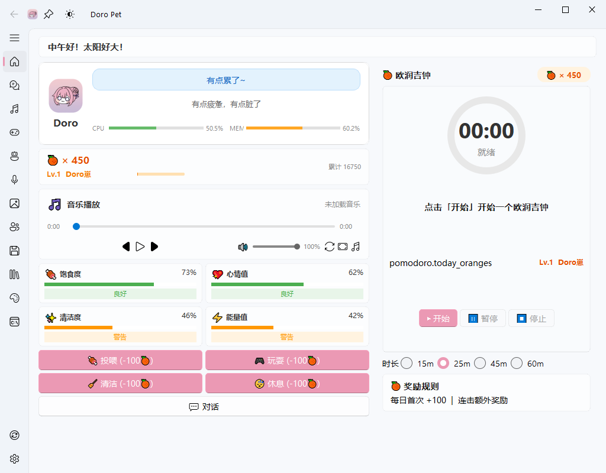</td>
  </tr>
  <tr>
    <td align="center"><b>⚙️ Settings</b></td>
    <td align="center"><b>🤖 Model Config</b></td>
    <td align="center"><b>🎭 Live2D Config</b></td>
  </tr>
  <tr>
    <td>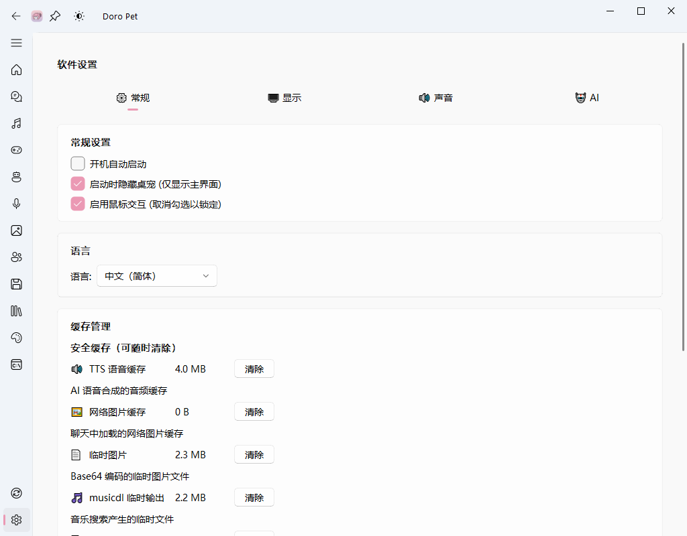</td>
    <td>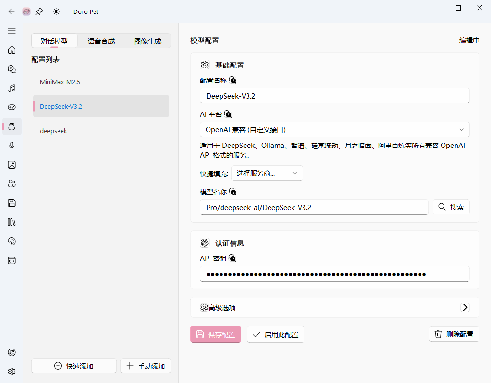</td>
    <td>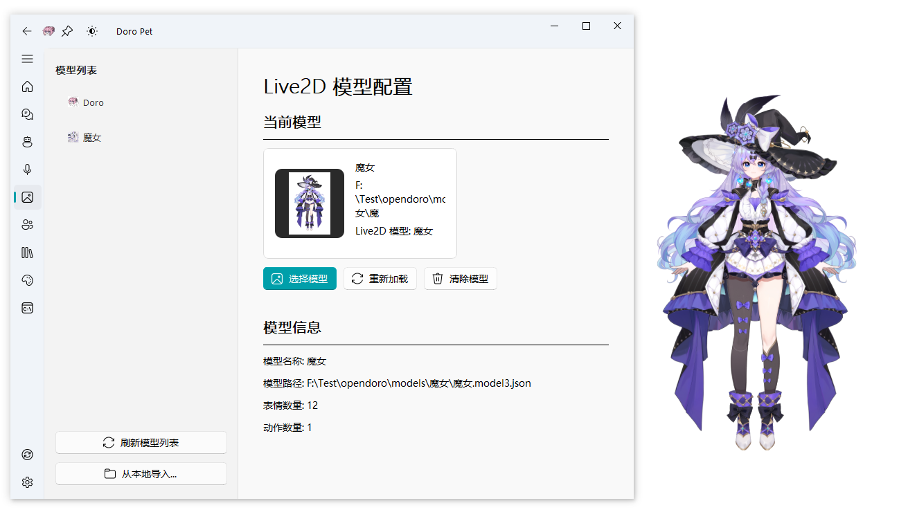</td>
  </tr>
  <tr>
    <td align="center"><b>🎙️ Voice Config</b></td>
    <td align="center"><b>🧠 Memory Manager</b></td>
    <td align="center"><b>💬 Immersive Chat</b></td>
  </tr>
  <tr>
    <td>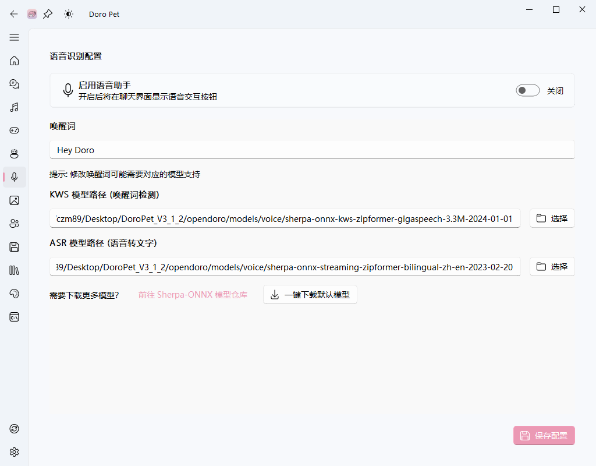</td>
    <td>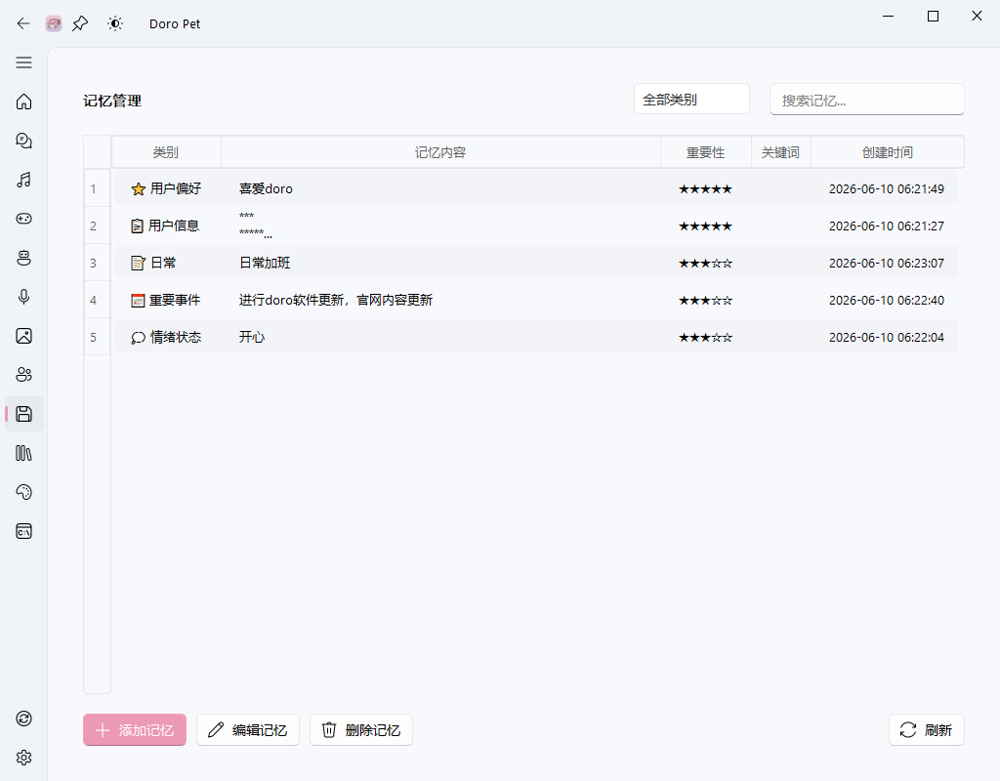</td>
    <td>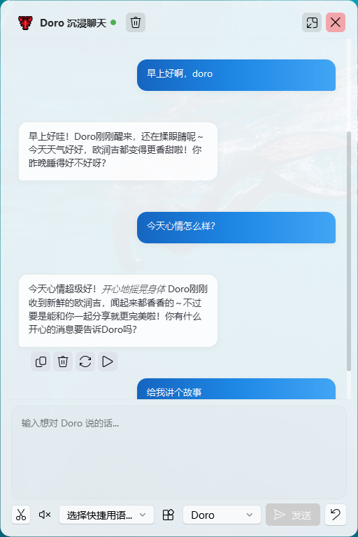</td>
  </tr>
  <tr>
    <td align="center"><b>🎵 Music Player</b></td>
    <td align="center"><b>📖 Novel Generator</b></td>
    <td align="center"><b>👤 Role Prompt</b></td>
  </tr>
  <tr>
    <td>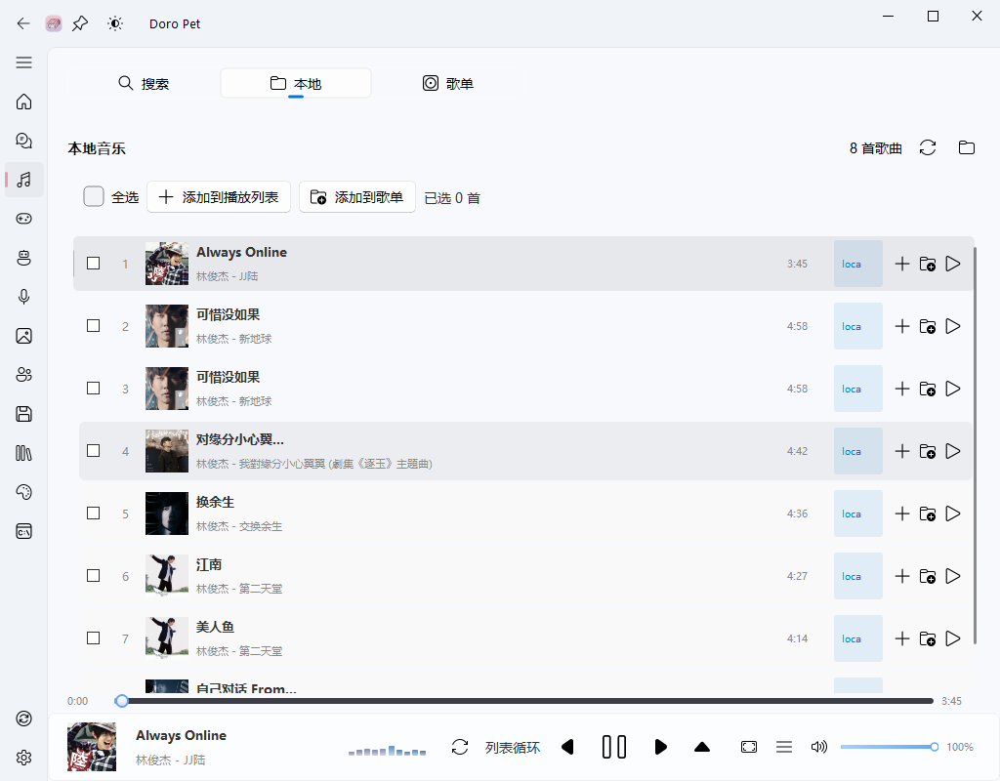</td>
    <td>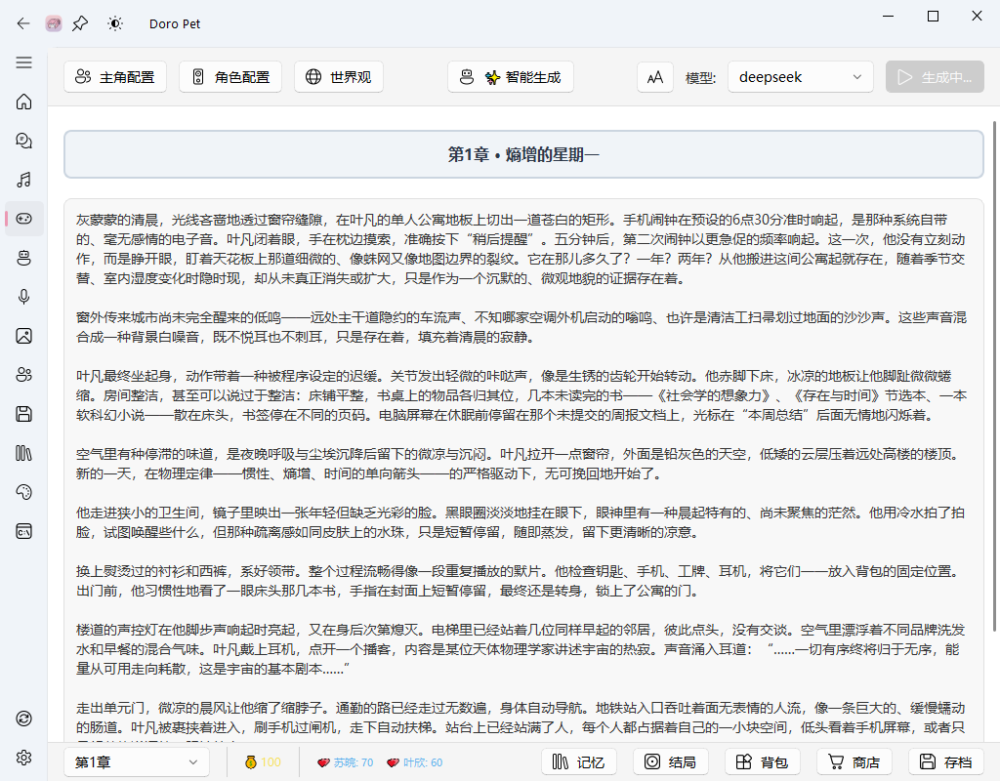</td>
    <td></td>
  </tr>
  <tr>
    <td align="center"><b>🎨 Agent Skills</b></td>
    <td align="center"><b>🔄 Updates</b></td>
    <td align="center"><b>📱 Context Menu</b></td>
  </tr>
  <tr>
    <td>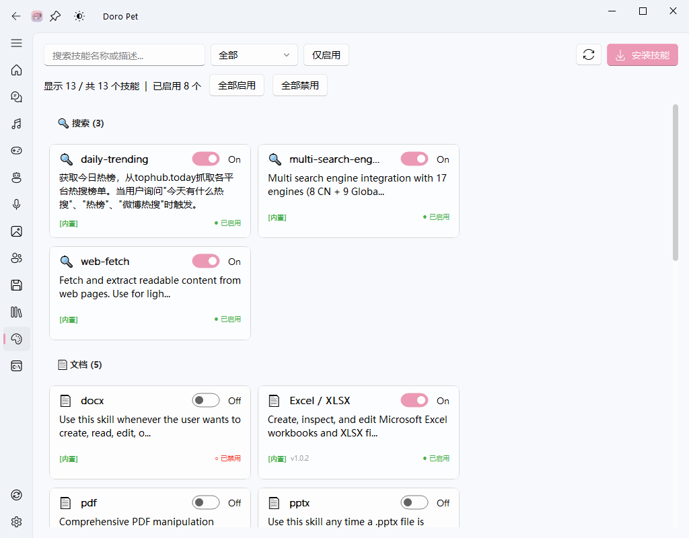</td>
    <td>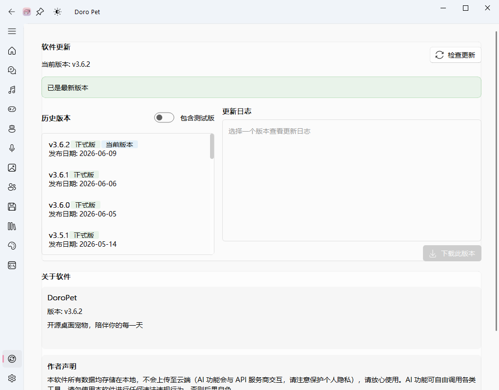</td>
    <td>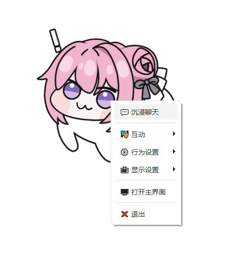</td>
  </tr>
  <tr>
    <td align="center"><b>🐭 Mouse Chase</b></td>
    <td align="center"><b>🔌 Plugins</b></td>
    <td align="center"><b>📋 Logs</b></td>
  </tr>
  <tr>
    <td>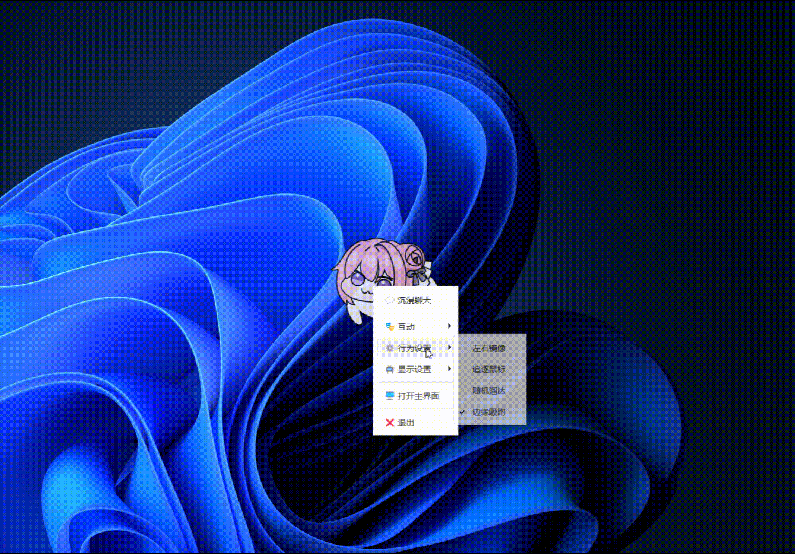</td>
    <td></td>
    <td>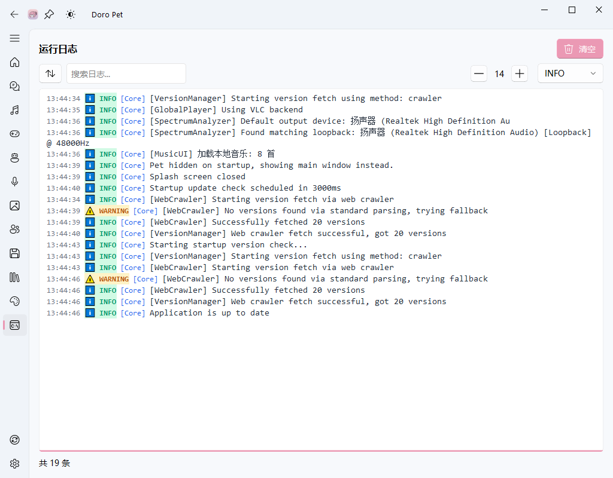</td>
  </tr>
</table>

---

## Quick Start

**Requirements**: Windows 10/11 64-bit, 4GB RAM, OpenGL 3.0+

### Method 1: Download Release (Recommended)

1. Get the latest ZIP from the [Releases Page](https://gitee.com/waterfeet/DoroPet_V3/releases)
2. Extract, then double-click `install_env.bat` to auto-setup
3. Double-click `start_app.bat` to launch

### Method 2: Run from Source

```bash
git clone https://gitee.com/waterfeet/DoroPet_V3.git
cd DoroPet_V3
pip install -r requirements.txt
python opendoro/main.py
```

After first launch, go to "Model Config" to add your API Key and start using.

---

## Tech Stack

| Layer | Technology |
|-------|-----------|
| GUI | PyQt5 + PyQt-Fluent-Widgets |
| Live2D | live2d-py + OpenGL v3 |
| AI | OpenAI SDK (multi-provider) |
| Voice | sherpa-onnx + edge-tts |
| Music | VLC + musicdl |
| Database | SQLite |

---

## License

This project is licensed under the [MIT License](LICENSE).
